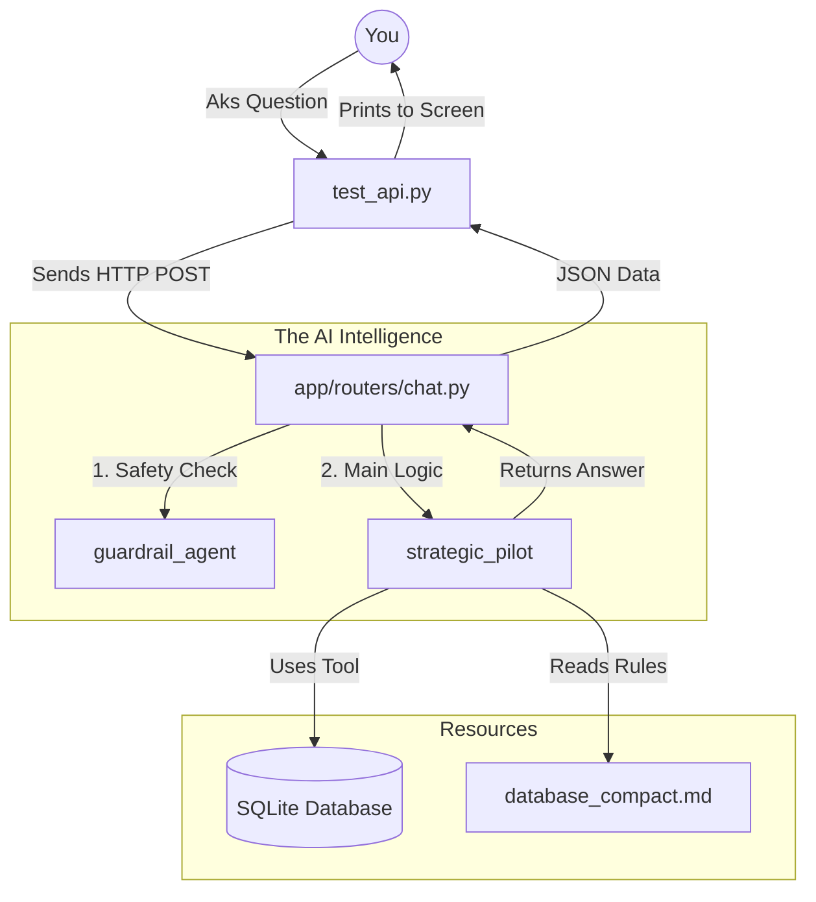

# 🤖 WaisWallet AI: Beginner's Guide to the Architecture

Welcome! This guide explains how the AI in WaisWallet works. If you've ever wondered how a message travels from a "Test" script to a "Brain" (Gemini 2.0) and back to you, this is for you.

---

## 🚀 The Life of a Query (Step-by-Step)

The relationship between `app/agents/pilot.py` and `test_api.py` is an indirect one through the FastAPI application structure. Here is the step-by-step lifecycle of a request:

Imagine you ask: *"What are my wallet balances?"*

### 1. The Starting Line: `test_api.py`
This is like a **remote control**. It doesn't have the logic itself; it just sends a signal. 
- It uses a `TestClient` to send a message to the "Address" `/chat/`.
- **Key File:** `test_api.py`

### 2. The Traffic Controller: `app/main.py`
This is the **front door** of your app. It sees the incoming signal and looks at its map.
- It says: *"Oh, this is for the 'chat' department!"* and directs the request to the correct router.
- **Key File:** `app/main.py`

### 3. The Security & Coordinator: `app/routers/chat.py`
This is your **Operations Room**. It manages the process:
- **Guardrail Check:** First, it asks the `guardrail_agent`: *"Is this person asking about money? Or are they trying to hack us/tell a joke?"*
- **Context Loading:** It reads your "Financial Brain" rules from `database_compact.md`.
- **Packaging:** it bundles your request with the rules and the database connection into a "Package" called `deps`.
- **Key File:** `app/routers/chat.py`

### 4. The Pilot (The Brain): `app/agents/pilot.py`
This is the **Pilot in the cockpit**. 
- It takes the message and the "Package" (dependencies).
- It looks at its **Tools**: *"To answer this, I need to check the database!"*
- It calls `get_wallet_balances()` (a tool).
- **Key File:** `app/agents/pilot.py`

### 5. The Workers: `app/agents/dependencies.py`
These are the **actual tools** the Pilot uses. 
- They jump into the SQL database, grab the numbers, and hand them back to the Pilot.
- **Key File:** `app/agents/dependencies.py`

---

## 🗺️ Visual Map



---

## 💡 Key Concepts for Beginners

### 1. What is an "Agent"?
Think of an **Agent** as a personality given to an AI model (like Gemini). In `pilot.py`, we tell the model: *"You are the Wais Wallet Strategic Pilot. Here are your rules."* This makes it behave like a financial expert rather than a generic chatbot.

### 2. What are "Tools"?
AI models cannot naturally see your files or your database. **Tools** are Python functions we give to the AI so it can "reach out" into the real world. For example, the `run_sql_query` tool allows the Pilot to read your transaction history.

### 3. What are "Guardrails"?
Guardrails is another AI Agent that acts as a **bouncer**. It makes sure the user is being appropriate. If you ask the financial pilot about the weather, the bouncer stops the request before it even reaches the Pilot, saving time and resources.

### 4. What are "Dependencies" (`deps`)?
This is a **toolbox**. Because the Pilot needs to access the database multiple times, we put the database connection and the business rules into a single object (`PilotDeps`) and hand it to the Pilot for the duration of the conversation.

---

## 🛠️ How to Test It
To see this entire flow in action, just run:
```bash
python test_api.py
```
Watch the terminal logs! You will see the **Tool Calls** being made in real-time as the Pilot "thinks" through your query.
