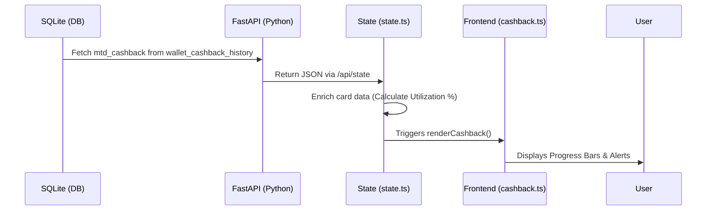

# 💰 Cashback Tracker: End-to-End Guide

The Cashback Tracker is responsible for monitoring your credit card rewards, visualization of monthly caps, and suggesting the best card strategy for your spending.

## 🔄 The Full-Stack Flow



---

## 🏗️ 1. Database Layer (The Source)
Rewards are tracked primarily in two tables:
- **`wallet_cashback_history`**: Stores the aggregated `amount_earned` and `monthly_limit` for each card per month (e.g., `2026-02`).
- **`transaction_details`**: Stores `cashback_earned` for every individual purchase.

## ⚙️ 2. Backend Layer (The Processor)
The backend calculates your rewards using the `benefits` defined in the `wallet_benefits` table.

**File: `app/routers/api.py`**
```python
@router.get("/state")
async def get_app_state(db: Connection):
    # Fetch MTD Summary for the current month
    cashback_mtd = db.execute("""
        SELECT wallet_id, amount_earned, monthly_limit 
        FROM wallet_cashback_history 
        WHERE month_year = '2026-02'
    """).fetchall()
    return {"cashbackMTD": cashback_mtd, ...}
```

## 🧠 3. State Layer (The Brain)
The frontend receives the raw data and "enriches" it. It calculates the logic of how much limit is left.

**File: `frontend/src/state.ts`**
```typescript
this.cards = data.wallets.map((w: any) => {
    const cb = data.cashbackMTD.find((c: any) => c.wallet_id === w.id);
    return {
        ...w,
        cashbackMTD: cb ? cb.amount_earned : 0,
        monthlyLimit: cb ? cb.monthly_limit : w.monthly_cashback_limit,
    };
});
```

## 🎨 4. Frontend Layer (The UI)
Finally, `cashback.ts` takes the state and turns it into beautiful progress bars.

**File: `frontend/src/modules/cashback.ts`**
```typescript
const earned = card.cashbackMTD || 0;
const limit = card.monthlyLimit || 0;
const pct = limit > 0 ? (earned / limit) * 100 : 0;

// Color changes based on utilization!
const colorClass = pct >= 100 ? 'bg-rose-500' : 'bg-emerald-500';

return `
    <div class="w-full h-3 bg-slate-100 rounded-full overflow-hidden">
        <div class="h-full ${colorClass}" style="width: ${pct}%"></div>
    </div>
`;
```

---

> [!TIP]
> **Pro Tip**: If a card is "Capped" (100% utilization), the AI Strategic Pilot will automatically suggest switching to your next best card for relevant categories!
