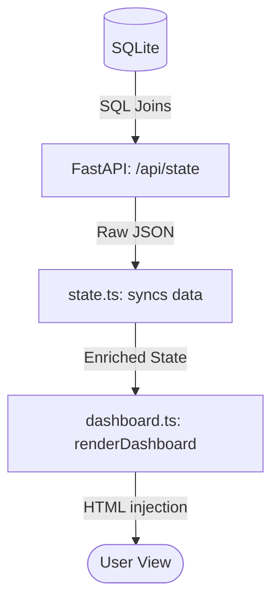

# 📊 Dashboard: The Nerve Center

The Dashboard is the first thing you see. It provides a real-time summary of your financial health by aggregating data from all other modules.

## 🔄 The Full-Stack Flow



---

## 🏗️ 1. Database Layer (The Source)
The Dashboard doesn't have its "own" table. Instead, it pulls from *everywhere*:
- **`income_transactions`**: To show your Total Income.
- **`transaction_headers` / `details`**: To calculate monthly expenses.
- **`wallet_cashback_history`**: To show YTD/MTD rewards.
- **`monthly_budgets`**: To show category progress bars.

## ⚙️ 2. Backend Layer (The Multi-Fetcher)
When the app starts, it calls a "God Endpoint" that fetches everything at once to avoid multiple slow requests.

**File: `app/routers/api.py`**
```python
@router.get("/state")
async def get_app_state(db: Connection):
    # Fetch income, wallets, recent transactions, budgets, etc.
    income = db.execute("SELECT SUM(amount) FROM income_transactions").fetchone()[0]
    return {
        "totalIncome": income,
        "transactions": recent_txs,
        "budgets": current_budgets,
        ...
    }
```

## 🧠 3. State Layer (The Sync)
The frontend "State" acts as a middleman. It takes the backend's raw data and prepares it for the UI.

**File: `frontend/src/state.ts`**
```typescript
async refresh() {
    const data = await api.getState();
    this.totalIncome = data.totalIncome || 0;
    this.transactions = data.transactions.map(...); // formats dates/amounts
    this.categoryBudgets = data.budgets || {};
}
```

## 🎨 4. Frontend Layer (The UI)
The `renderDashboard` function loops through the state and builds the HTML cards you see on the screen.

**File: `frontend/src/modules/dashboard.ts`**
```typescript
export const renderDashboard = () => {
    const totalExpenses = state.transactions
        .filter(t => t.category !== 'income')
        .reduce((sum, t) => sum + t.amount, 0);

    return `
        <div class="stat-card">
            <h3>Total Expenses</h3>
            <p>${formatCurrency(totalExpenses)}</p>
        </div>
        ...
    `;
}
```

---

> [!TIP]
> **Beginner Tip**: If you want to change how the Dashboard looks, `dashboard.ts` is the place to go. If you want to change the *numbers* shown, look at `api.py`.
