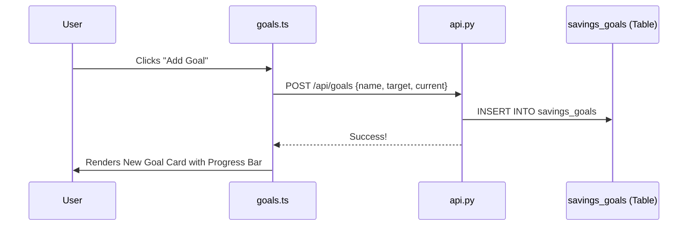

# 🎯 Financial Goals: Step-by-Step Guide

The Goals module helps you track long-term targets like an "Emergency Fund" or a "Japan Trip." It visualizes your progress and links goals to specific funding sources.

## 🔄 The Full-Stack Flow



---

## 🏗️ 1. Database Layer (The Storage)
Goals are stored in a dedicated table that tracks how much you have vs. how much you need.

**Table: `savings_goals`**
- `id`: Unique identifier.
- `name`: e.g., "Emergency Fund".
- `target_amount`: The ultimate goal (e.g., ₱100,000).
- `current_amount`: What you've saved so far.
- `status`: 'active' or 'completed'.

## ⚙️ 2. Backend Layer (The API)
We have two main interactions here: **Reading** (to show goals) and **Writing** (to create them).

**File: `app/routers/api.py`**
```python
@router.post("/goals")
async def create_goal(goal: GoalBase, db: Connection):
    cursor = db.execute("""
        INSERT INTO savings_goals (name, target_amount, current_amount, status)
        VALUES (?, ?, ?, 'active')
    """, (goal.name, goal.target_amount, goal.current_amount))
    db.commit()
    return {"status": "success", "id": cursor.lastrowid}
```

## 🧠 3. State Layer (The Mapper)
The state layer ensures that the goal data from the database is ready for the progress bars.

**File: `frontend/src/state.ts`**
```typescript
this.goals = data.goals.map((g: any) => ({
    ...g,
    current: g.current_amount,
    target: g.target_amount,
    color: g.color || 'bg-blue-600', // Default color if none set
}));
```

## 🎨 4. Frontend Layer (The UI)
The goal card uses simple math: `(current / target) * 100` to set the width of the progress bar.

**File: `frontend/src/modules/goals.ts`**
```typescript
const pct = Math.min((goal.current / goal.target) * 100, 100);

return `
    <div class="goal-card">
        <h4>${goal.name}</h4>
        <div class="progress-container">
            <div class="progress-bar" style="width: ${pct}%"></div>
        </div>
        <span>${Math.round(pct)}% Complete</span>
    </div>
`;
```

---

> [!NOTE]
> **Developer Note**: In the current version, "Source Tracking" (linking a goal to a specific wallet) is handled via UI metadata, but future versions will automate "Auto-Save" triggers from those wallets!
