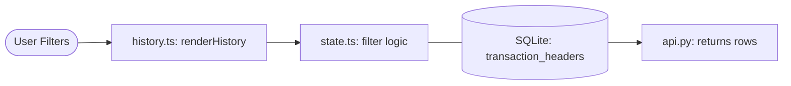

# 📜 Transaction History: The Audit Trail

The History module provides a comprehensive way to view, filter, and audit all your financial movements. It supports daily, monthly, and yearly views.

## 🔄 The Full-Stack Flow



---

## 🏗️ 1. Database Layer (The Source)
All history starts with these two key tables:
- **`transaction_headers`**: Stores the basics (Date, Merchant, Total Amount, Wallet used).
- **`transaction_details`**: Stores the categories and specific line items for each purchase.

## ⚙️ 2. Backend Layer (The Fetcher)
The history is fetched as part of the initial state but can be sorted and filtered.

**File: `app/routers/api.py`**
```python
@router.get("/state")
async def get_app_state(db: Connection):
    # Fetch recent transactions
    transactions = db.execute("""
        SELECT th.*, td.category_id, td.line_amount, td.cashback_earned
        FROM transaction_headers th
        JOIN transaction_details td ON th.id = td.header_id
        ORDER BY th.transaction_date DESC LIMIT 50
    """).fetchall()
    return {"transactions": transactions, ...}
```

## 🧠 3. State Layer (The Filter)
The frontend doesn't re-ask the database for every filter change. It filters the data already in memory for speed!

**File: `frontend/src/state.ts`**
```typescript
// Example of how the state maps the data
this.transactions = data.transactions.map((t: any) => ({
    ...t,
    amount: t.line_amount,
    merchant: t.merchant,
    date: t.transaction_date,
}));
```

## 🎨 4. Frontend Layer (The UI)
The `history.ts` module handles the complicated logic of grouping transactions by date.

**File: `frontend/src/modules/history.ts`**
```typescript
const filtered = state.transactions.filter(t => {
    // Check if transaction matches current filters (Date, Wallet, Category)
    return matchesDate && matchesWallet && matchesType;
});

// Grouping logic for the UI
const grouped = groupTransactionsByDate(filtered);
```

---

> [!TIP]
> **SOA Mode**: You can toggle "Statement of Account" (SOA) mode to filter specifically for one card. This is great for cross-checking your official bank statements!
