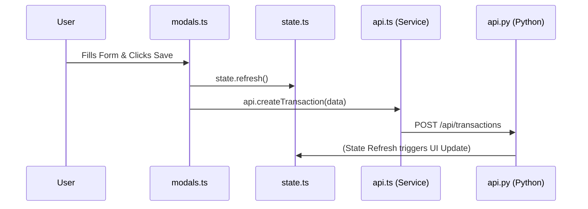

# 🪟 Modals & Forms: Adding Data

Modals are the "Input Centers" of the app. Every time you add a Transaction, a Wallet, or a Goal, you are interacting with this module.

## 🔄 The Full-Stack Flow (Saving a Transaction)



---

## 🏗️ 1. Database Layer (The Destination)
Forms save data directly into these primary tables:
- **`transaction_headers`**: For new spending.
- **`wallets`**: When adding new cards.
- **`savings_goals`**: When planning new targets.

## ⚙️ 2. Backend Layer (The Validator)
The backend doesn't just "save"—it validates your data (e.g., making sure numbers aren't negative).

**File: `app/routers/api.py`**
```python
@router.post("/transactions")
async def create_transaction(tx: TransactionBase, db: Connection):
    # Python logic inserts into Header first, then Detail
    cursor = db.execute("INSERT INTO transaction_headers ...")
    header_id = cursor.lastrowid
    db.execute("INSERT INTO transaction_details ...")
    db.commit()
    return {"status": "success"}
```

## 🧠 3. State Layer (The Trigger)
Once a form is saved, we must tell the *entire app* to update its numbers.

**File: `frontend/src/state.ts`**
```typescript
async refresh() {
    // This fetches the FRESH data from the DB 
    // and forces every page to re-render with new values!
    const data = await api.getState();
    ...
}
```

## 🎨 4. Frontend Layer (The UI)
This module manages the interactive elements like the Tab switching (Expense vs. Income).

**File: `frontend/src/modules/modals.ts`**
```typescript
const handleFormSubmit = async (e) => {
    e.preventDefault();
    const data = getFormData(e.target);
    await api.createTransaction(data);
    await state.refresh(); // Crucial: Updates the dashboard immediately!
    closeModal();
};
```

---

> [!IMPORTANT]
> **State Consistency**: Always call `state.refresh()` after a successful form submission. This ensures your Dashboard counts the new money correctly without needing a page reload!
