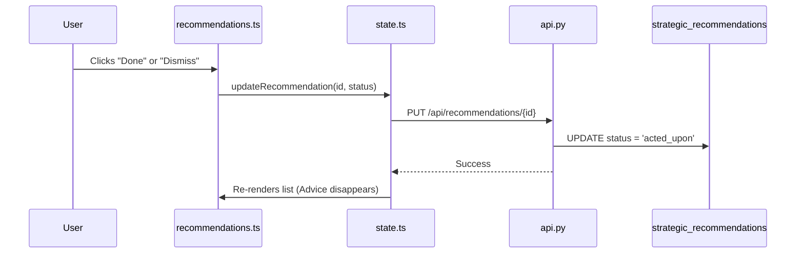

# 💡 Smart Recommendations: The Strategic Engine

Recommendations are the "Advice" cards generated by the AI to help you save more or earn more cashback. This guide explains how an advice card goes from the Database to your screen.

## 🔄 The Full-Stack Flow (Updating a Status)



---

## 🏗️ 1. Database Layer (The Source)
The AI writes advice into the **`strategic_recommendations`** table.
- `id`: Unique ID.
- `title`: e.g., "Cashback Opportunity".
- `message`: The actual advice text.
- `urgency_level`: 'critical', 'high', 'medium', or 'low' (used for color coding).
- `status`: 'pending', 'snoozed', 'acted_upon', or 'dismissed'.

## ⚙️ 2. Backend Layer (The Updater)
When you act on a recommendation, the backend updates its status so it doesn't show up again.

**File: `app/routers/api.py`**
```python
@router.put("/recommendations/{rec_id}")
async def update_recommendation(rec_id: int, rec: RecommendationUpdate, db: Connection):
    db.execute("UPDATE strategic_recommendations SET status = ? WHERE id = ?", (rec.status, rec_id))
    db.commit()
    return {"status": "success"}
```

## 🧠 3. State Layer (The Action)
The state layer handles the communication and local update.

**File: `frontend/src/state.ts`**
```typescript
async updateRecommendation(id: number, status: string) {
    // 1. Tell the backend to save the change
    await api.updateRecommendationStatus(id, status);
    
    // 2. Locally update the status so the UI changes immediately!
    const rec = this.recommendations.find(r => r.id === id);
    if (rec) rec.status = status;
}
```

## 🎨 4. Frontend Layer (The UI)
The `recommendations.ts` module decides which color to show based on the `urgency_level`.

**File: `frontend/src/modules/recommendations.ts`**
```typescript
const getUrgencyColor = (level: string) => {
    switch (level) {
        case 'critical': return 'bg-rose-600/20 text-rose-700';
        case 'high': return 'bg-amber-600/20 text-amber-700';
        default: return 'bg-blue-600/20 text-blue-700';
    }
};
```

---

> [!TIP]
> **AI Power**: Recommendations are generated by the **AI Navigator**. If you've been spending too much, you'll see a "Budget Warning" card appear here automatically!
