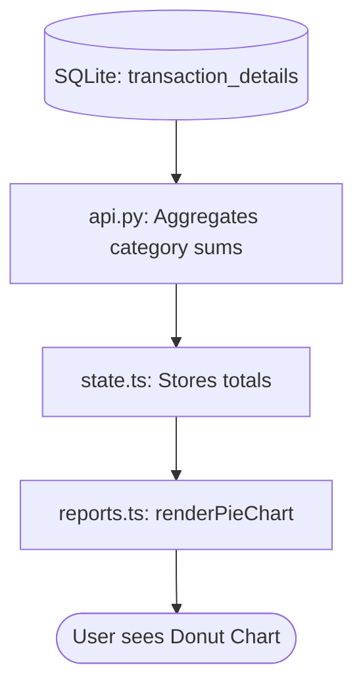

# 🥧 Financial Reports: The Visual Breakdown

The Reports module turns your raw transaction numbers into beautiful charts. It helps you see where your money is actually going.

## 🔄 The Full-Stack Flow



---

## 🏗️ 1. Database Layer (The Source)
Reports primarily use the **`transaction_details`** table because it contains the `category_id` and the `line_amount`.

## ⚙️ 2. Backend Layer (The Aggregator)
The backend helpfully prepares the category sums so the frontend doesn't have to do heavy math.

**File: `app/routers/api.py`**
```python
# The backend summarizes spending by category code
budgets = db.execute("""
    SELECT c.code as category, mb.amount
    FROM monthly_budgets mb
    JOIN categories c ON mb.category_id = c.id
    WHERE mb.month_year = '2026-02'
""").fetchall()
```

## 🧠 3. State Layer (The Storage)
The `state.ts` stores the current month being viewed (`reportDate`). When you change the month, `state.refresh()` is called to get new numbers.

**File: `frontend/src/state.ts`**
```typescript
this.categoryBudgets = data.budgets || {}; // Stores { "shopping": 5000, "food": 8000 }
```

## 🎨 4. Frontend Layer (The Chart)
The complicated part of this module is `renderPieChart`, which calculates the math for SVG (Scalable Vector Graphics).

**File: `frontend/src/modules/reports.ts`**
```typescript
const renderPieChart = (categories) => {
    // 1. Calculate the total for the month
    const total = categories.reduce((sum, c) => sum + c.value, 0);
    
    // 2. Loop through and draw SVG semi-circles (paths)
    let currentAngle = 0;
    return categories.map(cat => {
        const sliceAngle = (cat.value / total) * 360;
        const path = getSvgPath(currentAngle, sliceAngle);
        currentAngle += sliceAngle;
        return `<path d="${path}" fill="${cat.color}" />`;
    });
};
```

---

> [!NOTE]
> **Beginner Tip**: The chart is built using **pure SVG**. No external heavy charting libraries are used, which makes the app extremely fast and lightweight!
