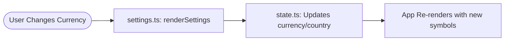

# ⚙️ Settings: Personalizing Your App

The Settings module allows you to configure your local context, such as your currency and region. This doesn't just change the symbols—it helps the AI understand your local market!

## 🔄 The Full-Stack Flow



---

## 🏗️ 1. Database Layer (The Source)
Currently, Settings are stored in the **Frontend State** for speed, but they inform how the AI interacts with your database. In future versions, these will be saved to a `user_preferences` table.

## ⚙️ 2. Backend Layer (The Context)
While there isn't a "Save Settings" API yet, the **AI Strategic Pilot** reads your region from the state to give you better advice (e.g., suggesting local banks).

## 🧠 3. State Layer (The Controller)
The state holds the "Source of Truth" for your preferred currency.

**File: `frontend/src/state.ts`**
```typescript
export const state = {
    currency: 'PHP',
    country: 'Philippines',
    refresh() {
        // Redraws the app using the selected currency
    }
};
```

## 🎨 4. Frontend Layer (The UI)
The `settings.ts` module renders the dropdowns and handles the switch logic.

**File: `frontend/src/modules/settings.ts`**
```typescript
const handleCurrencyChange = (e) => {
    state.currency = e.target.value;
    state.refresh(); // Forces everywhere to show the new symbol (₱, $, etc.)
};
```

---

> [!TIP]
> **Regional Logic**: Setting your country to "Philippines" tells the AI to prioritize advice for local cards like BDO, BPI, or UnionBank!
