# 🧪 Budget Simulator: The "What-If" Sandbox

The Simulator lets you test-drive a large purchase (like a new phone or a car) to see if you can actually afford it without breaking your budget.

## 🔄 The Full-Stack Flow

```mermaid
sequenceDiagram
    participant User
    participant UI as simulation.ts
    participant Pilot as AI Navigator
    participant DB as SQLite

    User->>UI: Inputs Purchase Amount (₱50,000)
    UI->>Pilot: "Can I afford this?"
    Pilot->>DB: Checks current balances & monthly budgets
    DB-->>Pilot: Returns data
    Pilot->>UI: Displays "Strategic Verdict" (e.g., 'Safe' or 'Risky')
```



---

## 🏗️ 1. Database Layer (The Context)
The simulator reads from **`wallets`** and **`monthly_budgets`** to see if your current cash flow can handle the new expense.

## ⚙️ 2. Backend Layer (The Simulation)
The AI Pilot uses its **Text-to-SQL** capability to analyze your financial health on the fly.

**Example AI Query:**
```sql
SELECT balance FROM wallets WHERE type = 'debit';
-- AI then calculates: (Balance - Purchase) > Emergency_Fund?
```

## 🧠 3. State Layer (The Calculator)
The state stores your "Simulation Scenario" so you can tweak the numbers.

**File: `frontend/src/state.ts`**
```typescript
simData: {
    amount: '',
    cardId: 1,
    paymentType: 'straight', // or 'installment'
    installments: '3',
}
```

## 🎨 4. Frontend Layer (The UI)
The `simulation.ts` module calculates the monthly amortization if you choose to pay in installments.

**File: `frontend/src/modules/simulation.ts`**
```typescript
const monthlyAmortization = amount / months;
// UI displays the impact on your NEXT 6 months of budgets!
```

---

> [!IMPORTANT]
> **What-If Wisdom**: The simulator doesn't just look at today. It looks at your **billing cycles** to tell you exactly which day is the best day to swipe your card!
