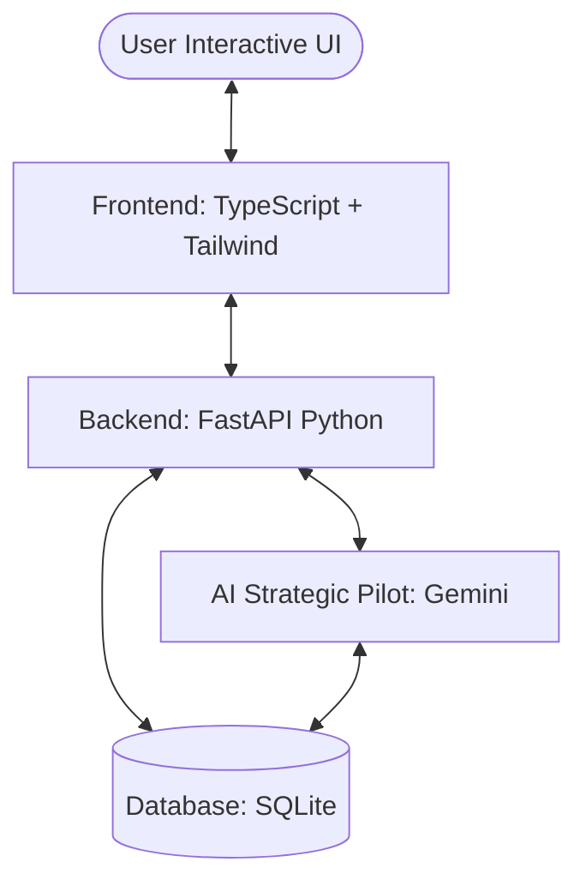

# 🌐 WaisWallet: System & Data Flow

This guide explains how WaisWallet handles data from the database to the UI, including the new AI Strategic Pilot.

## 🏗️ The High-Level Architecture

WaisWallet follows a **Modern Full-Stack Architecture**:



---

## 🛠️ Data Flow Breakdown (End-to-End)

### 1. 💰 Total Income
- **Frontend**: Renders in `dashboard.ts` via `totalIncome` stat card.
- **Backend**: `app/routers/api.py` -> `@router.get("/state")`
- **Database**: `SELECT SUM(amount) FROM income_transactions`
- **Code Path**:
  ```typescript
  // state.ts
  this.totalIncome = data.totalIncome || 0;
  ```

### 2. 💸 Total Expenses
- **Frontend**: Calculated in `dashboard.ts` by filtering `state.transactions`.
- **Logic**: Sums all transactions where `category !== 'income'`.
- **Database**: `transaction_details` table.

### 3. 💎 Estimated Cashback
- **Frontend**: Managed by `cashback.ts`.
- **Backend Logic**: `app/utils/wallet_benefits.py` calculates rates dynamically.
- **Database**: `wallet_benefits` and `wallet_cashback_history`.

---

## 🤖 AI Strategic Pilot (The Brain)

The co-pilot uses a **Hybrid Architecture** for maximum efficiency:

### A. The Research Flow (Reading Data)
When you ask *"How much did I spend at Starbucks?"*:
1. **Pilot** calls `run_sql_query`.
2. **SQL**: `SELECT SUM(line_amount) FROM transaction_headers JOIN transaction_details ... WHERE merchant LIKE '%Starbucks%'`.
3. **Pilot** receives raw numbers and translates them into a witty response.

### B. The Action Flow (Writing Data)
When you say *"Add a 500 peso grocery expense"*:
1. **Pilot** identifies the intent.
2. **Pilot** calls the **Tool**: `add_transaction(amount=500, category="Groceries", ...)`
3. **Backend**: Python validates the entry and inserts it into `transaction_headers` and `details`.

---

> [!IMPORTANT]
> **Safety First**: The AI is forbidden from writing raw SQL for `INSERT` or `DELETE`. It must use structured **Tools** that follow strict Python validation rules.

> [!TIP]
> For deeper dives into specific frontend modules, see the files in the `guide/` directory.
